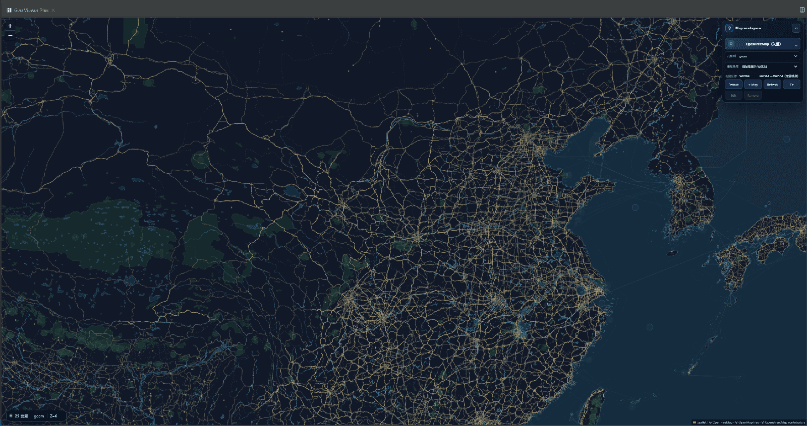
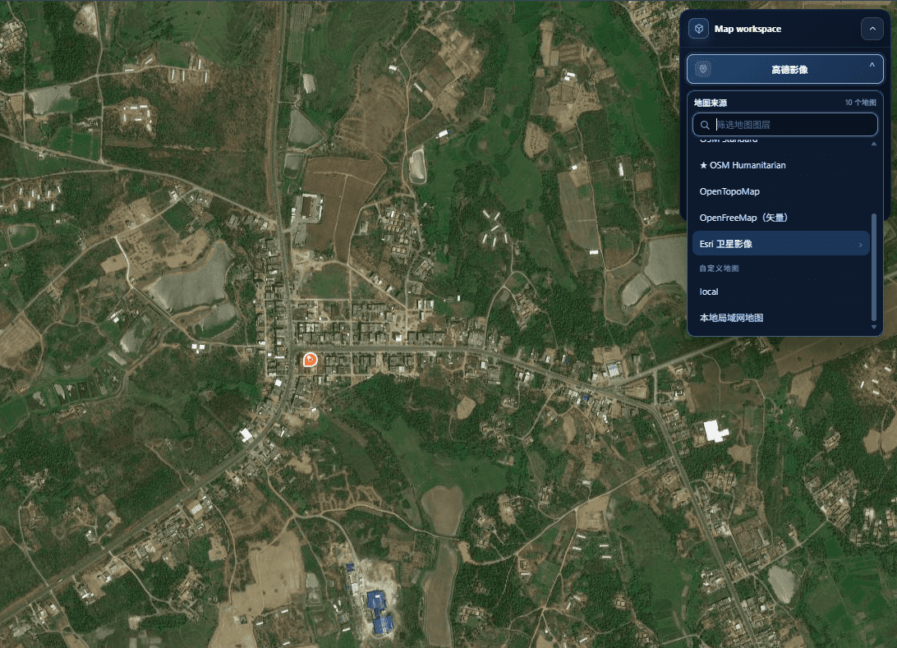
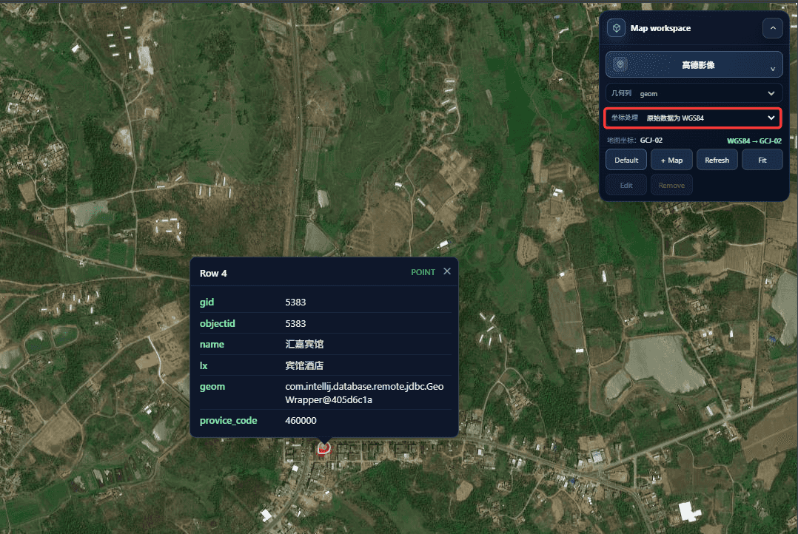
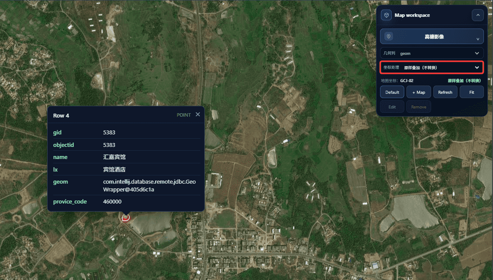
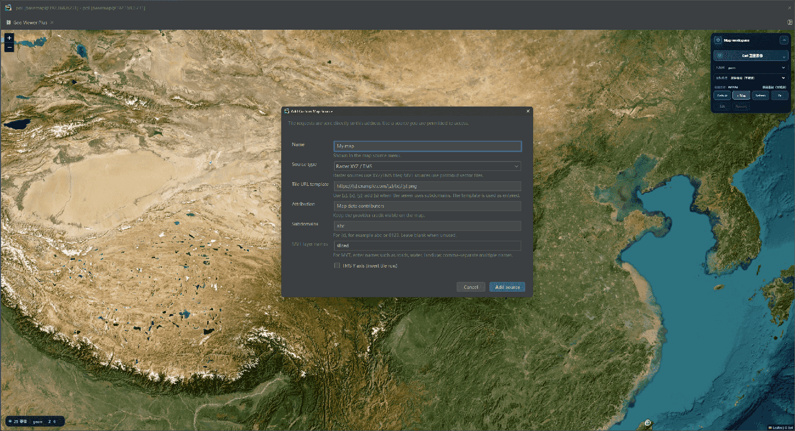

# Geo Viewer Plus

Geo Viewer Plus is a DataGrip/IntelliJ plugin for inspecting spatial result sets beside a database grid.

Plugin ID: `cn.duqimeng.geo-viewer-plus`  
Java package: `cn.duqimeng.geoviewerplus`

## Screenshots

Spatial features from the active result set rendered on a vector basemap, with the feature count, geometry column, and actual XYZ zoom level in the status bar.



The basemap switcher lists ten built-in sources — OSM variants, OpenTopoMap, OpenFreeMap vector, Esri World Imagery, AMap, and custom/local entries.



WGS84 result geometries are converted locally to GCJ-02 for the AMap/Tencent basemaps; the inspector shows the selected row's attributes.



When the data already matches the map projection, coordinate handling can overlay values as-is without conversion.



Custom XYZ/TMS and MVT sources are configured with tile URL templates, subdomains, and attribution.



## Features

- Uses DataGrip's live `DataGrid` context: clicking the action from a table editor or query result opens the current visible result set automatically.
- Own JCEF + Leaflet renderer and own result-set-to-WKT extraction; it does not open or reuse DataGrip's Geo Viewer content.
- Built-in basemap switcher with OSM Standard, OSM Humanitarian, OpenTopoMap, OpenFreeMap's keyless open-source vector tiles (updated weekly), Esri World Imagery (when ArcGIS Online is reachable), plus AMap road/imagery and a Tencent compatibility source. Domestic sources are explicitly marked GCJ-02.
- A display-only coordinate selector converts WGS84 result geometries to GCJ-02 for AMap/Tencent or BD-09 for Baidu. Conversion happens locally in the browser, is limited to mainland-China coordinates, and never writes to or changes the database value.
- `+ Add map` accepts XYZ/TMS and MVT tile templates, subdomains and attribution. Tile requests are sent directly to the configured provider; choose sources you are permitted to access and whose privacy policy you accept.
- Bidirectional selection: selecting a grid row focuses and highlights its geometry; clicking a geometry selects and scrolls to the corresponding grid row.
- **Refresh result data** re-reads the active grid after a query rerun, edit, filter, or sort.
- Collapsible floating map controls, persistent default basemap selection, tile-load retry feedback, actual XYZ zoom level display, geometry-column selection, and clear feedback when rows are skipped or cannot be rendered.
- EPSG:4326, EPSG:4979, EPSG:4490/CGCS2000, and EPSG:3857 geometry values are rendered in WGS84; unknown coordinate reference systems are skipped rather than plotted incorrectly.
- Compact feature inspector for point, line and polygon data.
- Tools > Open Geo Viewer Plus, the main toolbar, and the result-grid toolbars.
- A map icon in the main DataGrip toolbar that opens the viewer directly.

## Requirements

- DataGrip 2025.1 (build 251) through 2026.2 (build 262.\*).
- Runs on the IDE-bundled Java 21 runtime; the plugin is compiled with Java 17 bytecode to stay compatible across that range.

## Installation

Install the ZIP from **Settings | Plugins | ⚙ | Install Plugin from Disk…**. Geo Viewer Plus declares dynamic-plugin support, so DataGrip can normally enable or update it immediately without restarting. If an older viewer is open or the IDE reports that unloading failed, close its Geo Viewer Plus tab and retry; restart only when DataGrip explicitly requests it. The map icon is added to the main toolbar and **Tools | Open Geo Viewer Plus**.

## Usage

- Open the viewer from **Tools | Open Geo Viewer Plus**, the map icon in the main DataGrip toolbar, or the result-grid toolbar. The current visible result set is loaded automatically.
- Pick a geometry column and a basemap. When the result data is WGS84 and you switch to a GCJ-02 basemap (AMap/Tencent), enable the display-only coordinate conversion; choose *as-is overlay* when the data already matches the map coordinates.
- Select a grid row to focus and highlight its geometry, or click a geometry to select and scroll to the corresponding row. The feature inspector shows the row's attributes.
- Click **Refresh** after re-running, editing, filtering, or sorting the query to reload the grid.
- Use **+ Map** to add custom XYZ/TMS or MVT tile sources.

## Build

The build expects a local Gradle distribution and a local DataGrip SDK. Keep both outside the repository. It compiles against the 2025.1 baseline (build 251) with Java 21 and declares compatibility through build 262. The default SDK location is `tools/datagrip-sdk`; use `dataGripSdkPath` to verify another installed SDK:

```powershell
$env:JAVA_HOME = 'C:\Program Files\Java\jdk-21'
& '.\tools\gradle-8.10.2\bin\gradle.bat' verifyPlugin buildPlugin --no-daemon
```

The installable ZIP is written to `build/distributions/geo-viewer-plus-<version>.zip`.

### Standalone map preview

The DataGrip map template and the browser preview are intentionally separate. Build the standalone preview with:

```powershell
$env:JAVA_HOME = '.\tools\jdk-21.0.12.1+1'
& '.\tools\gradle-8.10.2\bin\gradle.bat' buildMapPreview --no-daemon
```

Open `build/preview/geo-viewer-plus-preview.html` in a browser for local UI testing or screenshots. It contains the complete built-in basemap list and sample point, line, and polygon data. The production `src/main/resources/geo-viewer-plus.html` remains a JCEF template and should not be opened directly.

## Versioning and releases

The version is defined once in `gradle.properties` as `pluginVersion`. Local rebuilds and normal fixes reuse the same version. Only a Marketplace release changes it:

- `0.1.0` — first public preview release.
- Patch fixes increment the patch number, for example `0.1.1`.
- New backward-compatible feature groups increment the minor number, for example `0.2.0`.
- Breaking changes increment the major number after the initial preview phase.

The first Marketplace upload must be done manually from `build/distributions/geo-viewer-plus-0.1.0.zip`. After the plugin page exists, later releases can use `publishPlugin` with the `intellijPlatformPublishingToken` Gradle property supplied through an environment variable or CI secret.

To publish a later patch release from the maintained Windows build environment, create a JetBrains Marketplace token and set it only in the local user environment:

```powershell
[Environment]::SetEnvironmentVariable("ORG_GRADLE_PROJECT_intellijPlatformPublishingToken", "YOUR_MARKETPLACE_TOKEN", "User")
```

Then create release notes in `release-notes/<new-version>.html`, open a new PowerShell session, and run:

```powershell
.\scripts\publish-plugin.ps1 -Bump patch
```

The release script injects that HTML into the Marketplace change notes and the IDE's plugin details. You can pass a different file with `-NotesFile path\to\notes.html`.

Keep Marketplace screenshots in `docs/media/<version>/`. The Marketplace Media section currently requires uploading those images in the plugin admin page; the official Gradle publish task does not manage page media.

Use `-Bump minor` for a backward-compatible feature group or `-Bump major` for a breaking release. The script checks for a clean worktree, increments `pluginVersion`, runs `publishPlugin`, commits the release, and pushes the Git tag. The token is never stored in the repository.

## Next integration seam

The live path is implemented by `OpenGeoViewerAction` and `CustomGeoViewerContent`: the action resolves the current `DataGrid`, `GeoDataExtractor` reads the visible rows and converts geometry values to WKT, and the plugin adds its own `RunnerLayoutUi` content below the current result panel. The old standalone placeholder window is no longer registered.
